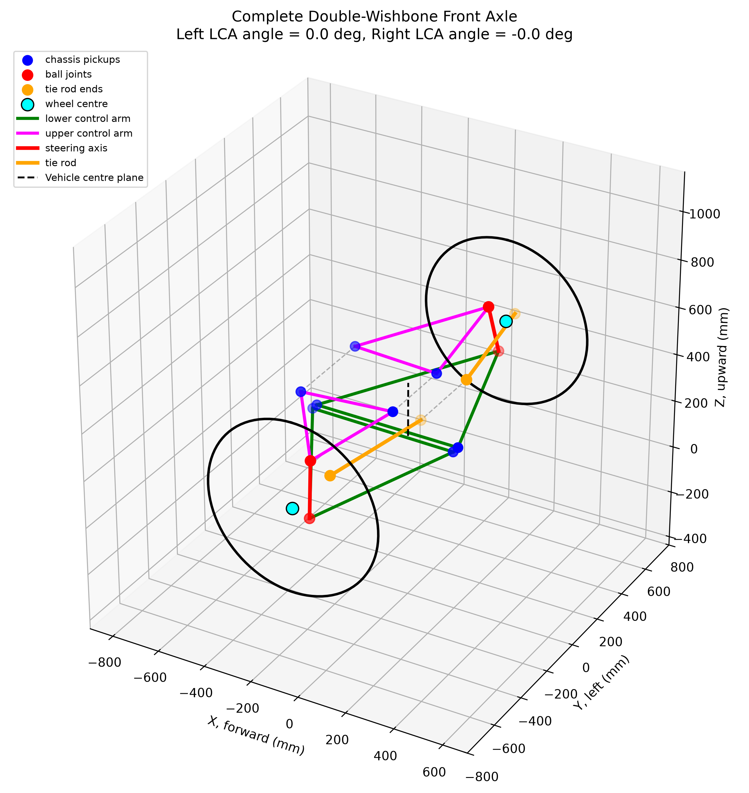
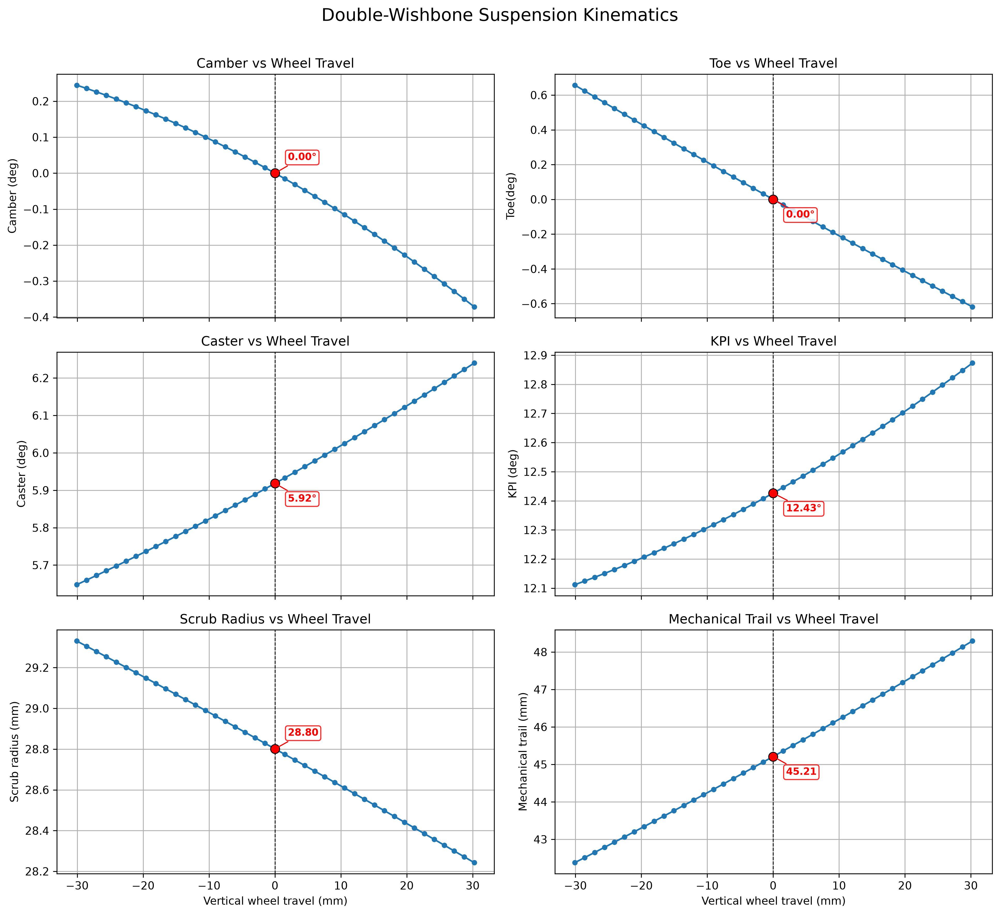
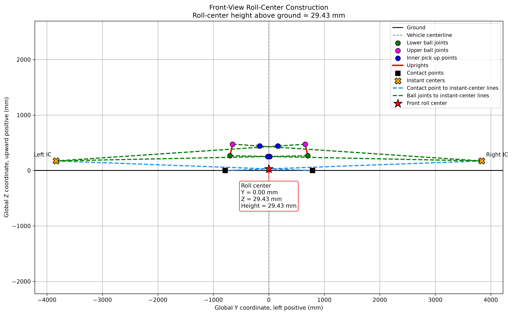
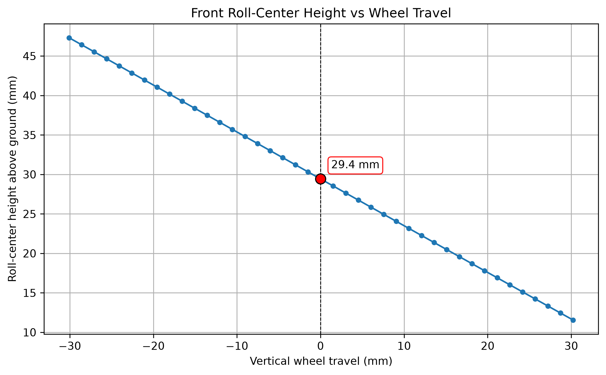

# Double-Wishbone Suspension Kinematics Solver

A custom **3D double-wishbone suspension kinematics solver** developed in Python to analyse suspension geometry throughout bump and rebound.

The program reconstructs and visualises the **complete 3D suspension geometry** from user-defined hardpoint coordinates and rigid-link constraints. It calculates key wheel alignment and steering parameters including **camber, toe, caster, kingpin inclination (KPI), scrub radius, mechanical trail, wheel travel, front-view instant centres, and front roll-centre migration**.

The solver was developed from first principles using **3D vector mathematics, arbitrary-axis rotation, trilateration, coordinate transformations, and numerical instantaneous-motion analysis**.

---

## Project Overview

The objective of this project was to develop a numerical tool for investigating how the geometry of a double-wishbone suspension changes as the wheel moves through vertical travel.

Rather than relying on a dedicated vehicle-dynamics or multibody simulation package, the suspension geometry is solved directly from its hardpoint coordinates and rigid-link constraints.

The model:

- Represents the suspension in a global 3D coordinate system
- Sweeps the lower control arm through a configurable angular range
- Solves the resulting upper ball-joint and tie-rod positions
- Reconstructs the upright and wheel assembly at every position
- Calculates wheel alignment and steering geometry
- Determines front-view instant centres
- Calculates the front axle roll centre
- Tracks roll-centre migration through suspension travel
- Verifies rigid-link constraints and left-right symmetry
- Automatically generates engineering plots for visualisation and analysis

---

## 3D Suspension Model

The solver reconstructs the complete front suspension geometry in three dimensions, including:

- Upper control arms
- Lower control arms
- Uprights
- Steering tie rods
- Wheel centres
- Wheel rotation axes
- Wheel outlines
- Chassis pickup points
- Left and right suspension assemblies



**Figure 1.** Complete 3D double-wishbone suspension model at the nominal design position.

---

## Coordinate System

The model uses the following global coordinate convention:

- **X** = forward
- **Y** = left / outboard
- **Z** = upward

All coordinates and lengths are specified in **millimetres**.

The suspension is defined using hardpoint coordinates for the **left side** of the:

- Lower control arm front inner pickup
- Lower control arm rear inner pickup
- Upper control arm front inner pickup
- Upper control arm rear inner pickup
- Lower ball joint
- Upper ball joint
- Inner tie rod
- Outer tie rod
- Wheel centre
- Hub-axis reference point
- Wheel radius

The **right side** of the vehicle is generated automatically by reflecting the suspension geometry across the vehicle centre plane.

Under reflection:

$$
Y_{\mathrm{right}} = -Y_{\mathrm{left}}
$$

while the X and Z coordinates remain unchanged.

---

## Kinematic Outputs

The solver evaluates the following parameters throughout suspension travel.

### Wheel Alignment

- Camber angle
- Toe angle
- Caster angle
- Kingpin inclination (KPI)

### Steering Geometry

- Scrub radius
- Mechanical trail

### Suspension Motion

- Wheel-centre X displacement
- Wheel-centre Y displacement
- Wheel-centre Z displacement

### Roll-Centre Geometry

- Front-view instant centres
- Front roll-centre position
- Roll-centre height above ground
- Roll-centre migration through suspension travel

The nominal design-position values are highlighted on the generated kinematic plots.



**Figure 2.** Camber, toe, caster, KPI, scrub radius, and mechanical trail plotted against vertical wheel travel.

---

# Numerical Methodology

## 1. Rigid-Link Geometry

At the nominal design position, the program calculates the fixed length of every suspension member from the supplied hardpoint coordinates.

For two points

$$
\mathbf{P}_1 = 
\begin{bmatrix} 
x_1 \\ 
y_1 \\ 
z_1 
\end{bmatrix}
$$

and

$$
\mathbf{P}_2 =
\begin{bmatrix}
x_2 \\
y_2 \\
z_2
\end{bmatrix}
$$

the link length is

$$
L =
\left\|
\mathbf{P}_2-\mathbf{P}_1
\right\|
$$

or equivalently,

$$
L =
\sqrt{
(x_2-x_1)^2+
(y_2-y_1)^2+
(z_2-z_1)^2
}
$$

These calculated lengths remain fixed throughout the suspension sweep.

---

## 2. Lower Control Arm Motion

The lower control arm is driven through a user-defined angular sweep.

The lower ball joint rotates around the axis connecting the front and rear lower-control-arm chassis pickups.

Because this axis can have an arbitrary orientation in three-dimensional space, the rotation is calculated using **Rodrigues' rotation formula**.

For a vector $\mathbf{v}$, rotation through angle $\theta\$ around the unit axis $\mathbf{k}\$ is:

```math
\mathbf{v}_{\mathrm{rot}}
=
\mathbf{v}\cos(\theta)
+
(\mathbf{k}\times\mathbf{v})\sin(\theta)
+
\mathbf{k}(\mathbf{k}\cdot\mathbf{v})(1-\cos(\theta))
```

This provides the new lower ball-joint position for each suspension position.

---

## 3. Upper Ball-Joint Position

Once the lower ball joint has moved, the upper ball-joint position must satisfy three simultaneous rigid-link constraints.

The unknown upper ball joint must remain:

1. A fixed distance from the UCA front inner pickup
2. A fixed distance from the UCA rear inner pickup
3. A fixed distance from the lower ball joint

These constraints can be represented as three spheres:

```math
\left\| \mathbf{P} - \mathbf{C}_1 \right\| = r_1
```
 
```math
\left\| \mathbf{P} - \mathbf{C}_2 \right\| = r_2
```
 
```math
\left\| \mathbf{P} - \mathbf{C}_3 \right\| = r_3
```

where $\mathbf{P}\$ is the unknown upper ball-joint position.

A **trilateration algorithm** is used to determine the intersection of the three spheres.

In general, two mathematical solutions may exist. The physically correct assembly configuration is selected as the solution closest to the upper ball-joint position from the previous suspension step.

This helps maintain solution continuity throughout the suspension sweep and prevents the solver from switching to the mirrored assembly configuration.

---

## 4. Steering Tie-Rod Position

The outer tie-rod position is solved using the same three-sphere intersection principle.

Its position must simultaneously maintain:

- Constant tie-rod length
- Constant distance to the lower ball joint
- Constant distance to the upper ball joint

The solution nearest the previous tie-rod position is selected to maintain the correct physical suspension configuration.

---

## 5. Upright Coordinate System

The wheel centre and hub-axis point are treated as rigidly attached to the upright.

A local coordinate system is constructed from the lower ball joint, upper ball joint, and outer tie rod.

The local upright Z direction is defined along the steering axis:

$$
\hat{\mathbf{z}} =
\frac{
\mathbf{UBJ}-\mathbf{LBJ}
}{
\left\|
\mathbf{UBJ}-\mathbf{LBJ}
\right\|
}
$$

The tie-rod vector is projected onto the plane perpendicular to the steering axis to construct the local Y direction.

The third orthogonal direction is obtained using the cross product:

$$
\hat{\mathbf{x}}
=
\hat{\mathbf{y}}
\times
\hat{\mathbf{z}}
$$

The original wheel-centre and hub-axis coordinates are transformed into this local upright reference frame.

At every suspension position, the wheel geometry can therefore be reconstructed from the new upright orientation while maintaining rigid-body geometry.

---

# Wheel Alignment Calculations

## Camber

Camber is calculated from the wheel rotation axis projected onto the front-view Y-Z plane.

The sign convention used is:

> **Positive camber = top of the wheel points outboard.**

The calculated camber angle is:

$$
\gamma =
\tan^{-1}
\left(
\frac{-h_z}
{s h_y}
\right)
$$

where:

- \(h_y\) and \(h_z\) are components of the wheel-axis vector
- \(s\) identifies the left or right side of the vehicle

---

## Toe

Toe is calculated by projecting the wheel rotation axis onto the X-Y plane.

The sign convention used is:

> **Positive toe = toe-in.**

The toe angle is:

$$
\tau =
\tan^{-1}
\left(
\frac{h_x}
{s h_y}
\right)
$$

---

## Caster

Caster is calculated from the steering-axis projection onto the X-Z plane.

The sign convention used is:

> **Positive caster = upper ball joint behind the lower ball joint.**

If

$$
\Delta \mathbf{P}
=
\mathbf{UBJ}-\mathbf{LBJ}
$$

then:

$$
\theta_{\mathrm{caster}}
=
\tan^{-1}
\left(
\frac{-\Delta X}{\Delta Z}
\right)
$$

---

## Kingpin Inclination

Kingpin inclination is calculated from the steering-axis projection in front view.

The sign convention used is:

> **Positive KPI = upper ball joint inboard of the lower ball joint.**

$$
\theta_{\mathrm{KPI}}
=
\tan^{-1}
\left(
\frac{-s\Delta Y}{\Delta Z}
\right)
$$

---

# Contact Patch Geometry

The wheel axis is defined from the wheel centre and hub-axis reference point.

The lowest point of the wheel is determined by projecting the global downward direction onto the plane perpendicular to the wheel axis.

This allows the model to calculate the instantaneous tyre contact-patch centre while accounting for changes in wheel orientation throughout suspension travel.

**IMPORTANT**: The suspension model **DOES NOT** account for proper tyre deformation during the wheel travel hence will provide inaccuracies in the model.

---

# Scrub Radius

The steering axis is extended until it intersects the instantaneous ground plane.

Scrub radius is calculated as the lateral distance between:

- The steering-axis intersection with the ground
- The tyre contact-patch centre

The sign convention is:

> **Positive scrub radius = contact patch outboard of the projected steering axis.**

The calculation is:

$$
SR
=
s
\left(
Y_{CP}-Y_{SA}
\right)
$$

where:

- \(Y_{CP}\) = contact-patch lateral coordinate
- \(Y_{SA}\) = steering-axis ground-intersection lateral coordinate

---

# Mechanical Trail

Mechanical trail is calculated using the longitudinal separation between the projected steering axis and the contact patch.

The sign convention is:

> **Positive mechanical trail = steering-axis intersection ahead of the contact patch.**

The calculation is:

$$
MT =
X_{SA}-X_{CP}
$$

where:

- \(X_{SA}\) = longitudinal coordinate of the steering-axis ground intersection
- \(X_{CP}\) = longitudinal coordinate of the tyre contact-patch centre

---

# Front-View Instant Centre

Because the suspension is modelled in full 3D, simply projecting the physical wishbone links into front view does not necessarily provide the exact instantaneous kinematic geometry.

Instead, the solver estimates the instantaneous motion of the upper and lower ball joints numerically.

For a suspension parameter \(\theta\), the position derivative is approximated using a central finite difference:

$$
\frac{d\mathbf{P}}{d\theta}
\approx
\frac{
\mathbf{P}(\theta+\Delta\theta)
-
\mathbf{P}(\theta-\Delta\theta)
}{
2\Delta\theta
}
$$

Only the Y-Z components are required for the front-view analysis.

The instantaneous centre must lie on a line perpendicular to the instantaneous velocity of each ball joint.

The solver therefore:

1. Calculates the projected LBJ displacement direction
2. Constructs a line perpendicular to this direction
3. Calculates the projected UBJ displacement direction
4. Constructs a line perpendicular to this direction
5. Intersects the two perpendicular lines

The resulting intersection is the **front-view instant centre**.

---

# Front Roll-Centre Calculation

The front roll centre is calculated using the instantaneous geometry of both sides of the axle.

For each side of the vehicle, the solver:

1. Calculates the front-view instant centre
2. Determines the tyre contact-patch centre
3. Constructs a line between the contact patch and instant centre

The intersection of the left and right contact-patch-to-instant-centre lines determines the front roll centre.



**Figure 3.** Front-view roll-centre construction showing suspension geometry, instantaneous centres, contact patches, force lines, and the calculated front roll centre.

The roll-centre height is measured relative to the instantaneous ground plane:

$$
h_{RC}
=
Z_{RC}-Z_{\mathrm{ground}}
$$

The calculation is repeated throughout the suspension sweep to determine roll-centre migration.



**Figure 4.** Front roll-centre height through symmetric vertical wheel travel.

---

# Suspension Sweep

The default suspension sweep rotates the lower control arm through:

```text
-10 deg to +10 deg
```

using:

```text
41 positions
```

These parameters can be changed directly in the Python script:

```python
ANGLE_START_DEG = -10.0
ANGLE_END_DEG = 10.0
NUMBER_OF_POSITIONS = 41
```

The sweep begins from the nominal design position and proceeds independently in the positive and negative directions.

This helps preserve the correct geometric solution when multiple sphere-intersection solutions are possible.

---

# Design Position

The nominal suspension design position corresponds to:

```text
LCA angle = 0 deg
Vertical wheel travel = 0 mm
```

The model evaluates the following static parameters at this condition:

- Camber
- Toe
- Caster
- KPI
- Scrub radius
- Mechanical trail
- Front roll-centre height

The design condition is highlighted on the generated kinematic figures to make the nominal geometry clearly distinguishable from its variation through suspension travel.

---

# Numerical Validation

Several checks are implemented to validate the calculated suspension geometry.

## Rigid-Link Constraint Verification

The solver compares calculated link lengths against their nominal design lengths.

The following constraints are checked:

- LCA front leg
- LCA rear leg
- UCA front leg
- UCA rear leg
- Tie rod
- Upright
- Lower ball joint to wheel centre
- Wheel centre to hub-axis point

For each link:

$$
e_L =
L_{\mathrm{calculated}}
-
L_{\mathrm{design}}
$$

Ideally:

$$
e_L \approx 0
$$

Small non-zero values may occur because of floating-point numerical precision.

---

## Left-Right Symmetry Verification

The right suspension is created by reflecting the left-hand hardpoints across:

$$
Y=0
$$

The solved left and right suspension positions are compared to ensure that the model preserves the expected mirror symmetry.

The verification includes:

- Lower ball joint
- Upper ball joint
- Outer tie rod
- Wheel centre
- Hub-axis point

---

# Automatically Generated Figures

When the program is executed, the primary engineering figures can be automatically exported as high-resolution PNG files.

The output structure is:

```text
double_wishbone_figures/
├── suspension_3d_model.png
├── suspension_kinematic_curves.png
├── front_roll_center_construction.png
└── roll_center_height.png
```

The figures can be exported at **300 DPI**, making them suitable for inclusion in an engineering portfolio or technical report.

---

# Features

- Full **3D double-wishbone suspension geometry**
- User-defined suspension hardpoints
- Configurable lower-control-arm sweep
- Arbitrary-axis control-arm rotation
- Three-sphere trilateration solver
- Rigid upright reconstruction
- Tie-rod and steering geometry
- Camber calculation
- Toe calculation
- Caster calculation
- Kingpin inclination calculation
- Scrub-radius calculation
- Mechanical-trail calculation
- Wheel-centre travel
- Contact-patch calculation
- Numerical front-view instant-centre calculation
- Front roll-centre calculation
- Roll-centre migration
- Full front-axle mirroring
- 3D suspension visualisation
- Automated kinematic plots
- Design-position highlighting
- Rigid-link constraint validation
- Left-right symmetry checks
- High-resolution figure export

---

# Technologies Used

- **Python**
- **NumPy**
- **Matplotlib**

The numerical suspension calculations were implemented directly using NumPy rather than a dedicated suspension-analysis or multibody-dynamics package.

---

# Repository Structure

The recommended repository structure is:

```text
double-wishbone-kinematics/
│
├── README.md
├── double_wishbone_kinematics.py
├── requirements.txt
│
└── double_wishbone_figures/
    ├── suspension_3d_model.png
    ├── suspension_kinematic_curves.png
    ├── front_roll_center_construction.png
    └── roll_center_height.png
```

---

# Installation

## 1. Clone the Repository

Clone the project using:

```bash
git clone https://github.com/YOUR-USERNAME/double-wishbone-kinematics.git
```

Then move into the project directory:

```bash
cd double-wishbone-kinematics
```

Replace `YOUR-USERNAME` with your GitHub username.

---

## 2. Create a Python Virtual Environment

Creating a virtual environment is optional but recommended.

### Windows

Create the environment:

```bash
python -m venv .venv
```

Activate it:

```bash
.venv\Scripts\activate
```

### macOS / Linux

Create the environment:

```bash
python3 -m venv .venv
```

Activate it:

```bash
source .venv/bin/activate
```

---

## 3. Install Dependencies

The solver requires:

```text
numpy
matplotlib
```

Install the required packages using:

```bash
pip install numpy matplotlib
```

Alternatively, if a `requirements.txt` file is included:

```bash
pip install -r requirements.txt
```

A minimal `requirements.txt` is:

```text
numpy
matplotlib
```

---

# Running the Solver

Run the main Python script from the repository directory.

### Windows

```bash
python double_wishbone_kinematics.py
```

### macOS / Linux

```bash
python3 double_wishbone_kinematics.py
```

The program will:

1. Construct the left suspension model
2. Generate the mirrored right suspension
3. Calculate all rigid-link lengths
4. Perform the suspension sweep
5. Calculate alignment and steering parameters
6. Calculate the front-view instant centres
7. Calculate the front roll centre
8. Validate the suspension geometry
9. Generate the kinematic figures
10. Export the portfolio figures as PNG files
11. Display the generated Matplotlib figures

---

# Defining a Custom Suspension

Suspension geometry is specified using the `hardpoints` dictionary:

```python
hardpoints = {
    # Lower control arm
    "LCA_front_inner": np.array([47.0, 112.0, 485.0]),
    "LCA_rear_inner": np.array([-246.0, 108.0, 450.0]),

    # Upper control arm
    "UCA_front_inner": np.array([161.0, 136.0, 618.0]),
    "UCA_rear_inner": np.array([-87.0, 131.0, 574.0]),

    # Ball joints
    "lower_ball_joint": np.array([16.0, 574.0, 315.0]),
    "upper_ball_joint": np.array([-8.0, 571.0, 485.0]),

    # Wheel geometry
    "wheel_center": np.array([-8.0, 625.0, 400.0]),
    "hub_axis_point": np.array([-8.0, 675.0, 400.0]),

    # Steering tie rod
    "tie_rod_inner": np.array([-40.0, 180.0, 400.0]),
    "tie_rod_outer": np.array([-20.0, 520.0, 390.0]),

    # Wheel radius
    "wheel_radius_mm": 250.0,
}
```

Each point is entered as:

```text
[X, Y, Z]
```

in millimetres.

To investigate a different suspension design, replace these coordinates with the required vehicle hardpoints.

---

# Changing Suspension Travel

The analysed control-arm range can be modified using:

```python
ANGLE_START_DEG = -10.0
ANGLE_END_DEG = 10.0
NUMBER_OF_POSITIONS = 41
```

For example:

```python
ANGLE_START_DEG = -8.0
ANGLE_END_DEG = 12.0
NUMBER_OF_POSITIONS = 81
```

would analyse a different control-arm rotation range with greater resolution.

---

# Changing the 3D Display Position

The suspension position shown in the 3D visualisation is controlled by:

```python
DISPLAY_ANGLE_DEG = 0.0
```

For example:

```python
DISPLAY_ANGLE_DEG = 5.0
```

will display the suspension at an LCA rotation of \(5^\circ\).

Changing the display angle does not change the full kinematic sweep.

---

# Engineering Workflow

The overall computational process is:

```text
User-defined suspension hardpoints
              |
              v
     Calculate rigid-link lengths
              |
              v
   Rotate lower control arm in 3D
              |
              v
      Solve upper ball joint
              |
              v
       Solve outer tie rod
              |
              v
       Reconstruct upright
              |
              v
    Reconstruct wheel geometry
              |
              v
 Calculate alignment + steering
              |
              v
 Calculate instantaneous centres
              |
              v
       Calculate roll centre
              |
              v
 Generate plots + validation checks
```

---

# Current Scope and Assumptions

The model is intended primarily for **kinematic suspension analysis**.

Current assumptions include:

- Suspension members are perfectly rigid
- Chassis pickup points remain fixed
- No component compliance is modelled
- No bushing compliance is modelled
- No structural deflection is modelled
- No tyre deformation is modelled
- The analysis is quasi-static
- Forces and moments are not currently solved
- Roll-centre behaviour is evaluated using geometric kinematics
- The wheel is represented geometrically using its centre, axis, and radius

The calculated results therefore represent **ideal geometric suspension behaviour** rather than the complete behaviour of a real vehicle under load.

---

# Potential Future Development

Possible extensions to the model include:

- Bump-steer optimisation
- Camber-gain optimisation
- Automated suspension hardpoint optimisation
- Steering input and Ackermann analysis
- Body roll simulation
- Independent left/right wheel displacement
- Roll-centre migration during vehicle roll
- Motion-ratio calculation
- Spring and damper geometry
- Anti-dive analysis
- Anti-squat analysis
- Tyre geometry and loaded-radius modelling
- Suspension compliance effects
- Force and load-transfer analysis
- Interactive hardpoint input
- Automated CSV export of kinematic results
- Comparison between multiple suspension designs
- Graphical user interface for suspension configuration

---

# Motivation

This project was developed to strengthen my understanding of the relationship between **3D suspension geometry, vehicle kinematics, numerical methods, and vehicle dynamics**.

Building the solver from first principles provided practical experience with:

- Translating physical engineering geometry into mathematical constraints
- Implementing 3D vector mathematics computationally
- Solving geometric constraint problems
- Managing multiple valid geometric solutions
- Developing numerical verification methods
- Analysing suspension kinematic behaviour
- Visualising complex engineering geometry
- Communicating engineering results through technical plots

---

# Author

**Denzel Kurniadi Hartono**

BEng Mechanical Engineering  
University College London

[LinkedIn](https://www.linkedin.com/in/denzel-kurniadi-h)

---
